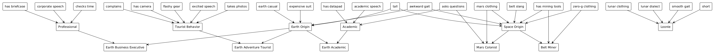

***FCIM.FIA - Fundamentals of Artificial Intelligence***

> **Lab 1:** *Expert Systems* \
> **Performed by:** *Dumitru Moraru*, group *FAF-212* \
> **Verified by:** Elena Graur, asist. univ.

Imports and Utils


```python
from random import randint
from rules import *
from rules_example_zookeeper import *
from production import *
from utils import *
```

# Task 1
To develop the expert system, I began by defining the knowledge base as a hierarchical goal tree. The system is designed to reach one of six primary conclusions: `Earth Business Executive`, `Earth Adventure Tourist`, `Earth Academic`, `Mars Colonist`, `Belt Miner`, and `Loonie`.

These main hypotheses are classified into three distinct branches based on observable traits. The primary groupings are `Earth Origin` and `Space Origin`, with `Loonie` forming its own category. The `Earth Origin` branch includes the professional, tourist, and academic profiles, while the `Space Origin` branch further distinguishes between Mars Colonists and Belt Miners. The system uses intermediate concepts like `Professional`, `Tourist Behavior`, and `Academic` to connect initial observations to these final conclusions.



# Task 2
The `rules` defines the connection between the intermediary facts and hypotheses and the initial facts. Each rule includes only two conditions and there is only one rule which is of type `OR`. The rest of the rules are of the `AND` type. It is important to mention one convention regarding the structure of each rule. All of the intermediary facts are placed as the first condition in each of the rules. It helps further with the `interactive traversal` of the goal tree.


```python
from production import IF, AND, THEN, OR, DELETE, NOT, FAIL

MY_RULES = (
    IF( AND( '(?x) wears expensive suit',          # R1
             '(?x) is tall' ),
        THEN( '(?x) has Earth Origin' )),

    IF( AND( '(?x) wears flashy gear',             # R2
             '(?x) has awkward gait' ),
        THEN( '(?x) has Earth Origin' )),

    IF( AND( '(?x) wears earth casual',            # R3
             '(?x) is tall' ),
        THEN( '(?x) has Earth Origin' )),

    IF( AND( '(?x) wears mars clothing',           # R4
             '(?x) has awkward gait' ),
        THEN( '(?x) has Space Origin' )),

    IF( AND( '(?x) wears zero-g clothing',         # R5
             '(?x) speaks belt slang' ),
        THEN( '(?x) has Space Origin' )),

    IF( AND( '(?x) speaks excited speech',         # R6
             '(?x) takes photos' ),
        THEN( '(?x) shows Tourist Behavior' )),

    IF( AND( '(?x) has camera',                    # R7
             '(?x) complains' ),
        THEN( '(?x) shows Tourist Behavior' )),

    IF( AND( '(?x) speaks corporate speech',       # R8
             '(?x) has briefcase' ),
        THEN( '(?x) is Professional' )),

    IF( AND( '(?x) checks time',                   # R9
             '(?x) wears expensive suit' ),
        THEN( '(?x) is Professional' )),

    IF( AND( '(?x) speaks academic speech',        # R10
             '(?x) asks questions' ),
        THEN( '(?x) is Academic' )),

    IF( AND( '(?x) has datapad',                   # R11
             '(?x) wears earth casual' ),
        THEN( '(?x) is Academic' )),

    IF( AND( '(?x) has Earth Origin',              # R12
             '(?x) is Professional' ),
        THEN( '(?x) is Earth Business Executive' )),

    IF( AND( '(?x) has Earth Origin',              # R13
             '(?x) shows Tourist Behavior' ),
        THEN( '(?x) is Earth Adventure Tourist' )),

    IF( AND( '(?x) has Earth Origin',              # R14
             '(?x) is Academic' ),
        THEN( '(?x) is Earth Academic' )),

    IF( AND( '(?x) has Space Origin',              # R15
             '(?x) asks questions' ),
        THEN( '(?x) is Mars Colonist' )),

    IF( AND( '(?x) has Space Origin',              # R16
             '(?x) has mining tools' ),
        THEN( '(?x) is Belt Miner' )),

    IF( OR( '(?x) wears lunar clothing',           # R17
            '(?x) speaks lunar dialect',
            '(?x) has smooth gait',
            '(?x) is short' ),
        THEN( '(?x) is Loonie' )),
)
```

# Task 3  
The primary algorithm required for implementing the expert system is `forward chaining`. Also referred to as forward deduction or forward reasoning, this method is used within an inference engine. Forward chaining begins with the initial facts stored in the knowledge base and systematically applies inference rules in a forward manner to derive new information until a specific goal is achieved.  

The algorithm provided in the laboratory work instructions is relatively simple. It iterates through a set of rules, attempting to apply them to each fact in the given list until it reaches an intermediate fact or hypothesis. Below is a detailed output of the `forward_chain` method, illustrating how the algorithm progressively accumulates facts until the hypothesis is confirmed. Additionally, the output highlights the difference between the initial data set and the information obtained after executing forward chaining on the goal tree.


```python
def forward_chain(rules, data, apply_only_one=False, verbose=False):
    old_data = ()

    while set(old_data) != set(data):
        old_data = list(data)
        for condition in rules:
            data = condition.apply(data, apply_only_one, verbose)
            if set(data) != set(old_data):
                break

    return data
facts = ['tim has Earth Origin', 'tim is Professional']
resulting_facts = forward_chain(MY_RULES, facts, verbose = True)
print(f"\n{set(resulting_facts) - set(facts)}")
```

    Rule: IF(AND('(?x) has Earth Origin', '(?x) is Professional'), THEN('(?x) is Earth Business Executive'))
    Added: tim is Earth Business Executive
    
    {'tim is Earth Business Executive'}


# Task 4  
Implement backward chaining to determine whether a given hypothesis can be inferred from a set of rules. This approach operates recursively, attempting to validate each condition required to establish the hypothesis.  

**Parameters:**  
- **rules (list):** A collection of rules that define the inference system.  
- **hypothesis (str):** The target hypothesis or goal to be verified.  
- **verbose (bool):** If set to `True`, displays detailed information about the backward chaining process.  

**Returns:**  
- **bool:** Returns `True` if the hypothesis can be derived, otherwise returns `False`.  


```python
def backward_chain(rules, hypothesis, verbose=False):
    """
    Implement backward chaining to determine whether a given hypothesis can be inferred from a set of rules.

    Parameters:
    - rules (list): A collection of rules that define the inference system.
    - hypothesis (str): The target hypothesis or goal to be verified.
    - verbose (bool): If set to True, displays detailed information about the backward chaining process.

    Returns:
    - bool: Returns True if the hypothesis can be derived, otherwise returns False.
    """
    def is_variable(token):
        return token.startswith("(?") and token.endswith(")")

    def unify(statement1, statement2):
        bindings = {}
        tokens1 = statement1.split()
        tokens2 = statement2.split()

        if len(tokens1) != len(tokens2):
            return None

        for t1, t2 in zip(tokens1, tokens2):
            if is_variable(t1):
                var_name = t1[2:-1]
                if var_name in bindings:
                    if bindings[var_name] != t2:
                        return None
                else:
                    bindings[var_name] = t2
            elif t1 != t2:
                return None

        return bindings

    def substitute(statement, bindings):
        result = statement
        for var, val in bindings.items():
            result = result.replace(f"(?{var})", val)
        return result

    def evaluate_antecedents(antecedent, rules, bindings, visited, verbose):
        if isinstance(antecedent, AND):
            return all(backward_chain_internal(rules, substitute(clause, bindings), visited, verbose, inside_rule=True)
                       for clause in antecedent)
        elif isinstance(antecedent, OR):
            return any(backward_chain_internal(rules, substitute(clause, bindings), visited, verbose, inside_rule=True)
                       for clause in antecedent)
        else:
            return backward_chain_internal(rules, substitute(antecedent, bindings), visited, verbose, inside_rule=True)

    def can_be_derived_by_rules(goal, rules):
        for rule in rules:
            conclusion = rule.consequent()[0]
            if unify(conclusion, goal):
                return True
        return False

    def backward_chain_internal(rules, hypothesis, visited, verbose, inside_rule):
        if hypothesis in visited:
            return False
        visited.add(hypothesis)

        for rule in rules:
            conclusion = rule.consequent()[0]
            bindings = unify(conclusion, hypothesis)
            if bindings is not None:
                antecedents = rule.antecedent()
                if verbose:
                    print(f"[Trying Rule] {rule}")
                    print(f"[Bindings] {bindings}")
                    print(f"[Antecedent] {antecedents}")
                if evaluate_antecedents(antecedents, rules, bindings, visited, verbose):
                    if verbose:
                        print(f"[Success] Derived {hypothesis} via rule {rule}")
                    return True
                elif verbose:
                    print(f"[Fail] Could not verify antecedents for {hypothesis}")

        # Leaf fallback: only if we're *inside* a derivation path
        if inside_rule and not can_be_derived_by_rules(hypothesis, rules):
            if verbose:
                print(f"[Leaf Accepted] No rules derive: {hypothesis}")
            return True

        return False

    return backward_chain_internal(rules, hypothesis, visited=set(), verbose=verbose, inside_rule=False)

hypothesis = "Mark shows Tourist Behavior"
backward_chain(MY_RULES, hypothesis, verbose=True)
```

    [Trying Rule] IF(AND('(?x) speaks excited speech', '(?x) takes photos'), THEN('(?x) shows Tourist Behavior'))
    [Bindings] {'x': 'Mark'}
    [Antecedent] AND('(?x) speaks excited speech', '(?x) takes photos')
    [Leaf Accepted] No rules derive: Mark speaks excited speech
    [Leaf Accepted] No rules derive: Mark takes photos
    [Success] Derived Mark shows Tourist Behavior via rule IF(AND('(?x) speaks excited speech', '(?x) takes photos'), THEN('(?x) shows Tourist Behavior'))


    True


# Task 5  
The system features a mechanism for posing random questions to collect facts from the user. This step is integral to the forward chaining process, allowing the system to construct a knowledge base before applying inference rules.


```python
import sys
from production import forward_chain, backward_chain, IF, AND, OR, NOT
from rules import MY_RULES

class Question:
    def __init__(self, prompt, var, qtype="yesno", options=None):
        self.prompt = prompt
        self.var = var
        self.qtype = qtype
        self.options = options or []

    def ask(self):
        if self.qtype == "yesno":
            while True:
                ans = input(f"{self.prompt} (yes/no): ").strip().lower()
                if ans in ("yes", "y"):
                    return True
                elif ans in ("no", "n"):
                    return False
                print("Please answer yes or no.")
        elif self.qtype == "multiple":
            print(self.prompt)
            for i, opt in enumerate(self.options, 1):
                print(f"  {i}) {opt}")
            while True:
                ans = input(f"Choose 1-{len(self.options)}: ").strip()
                if ans.isdigit():
                    idx = int(ans) - 1
                    if 0 <= idx < len(self.options):
                        return self.options[idx]
                print("Invalid choice.")
        elif self.qtype == "input":
            ans = input(f"{self.prompt}: ").strip()
            return ans
        else:
            raise ValueError(f"Unknown question type: {self.qtype}")

class ExpertSystem:
    def __init__(self, rules):
        self.rules = rules
        self.facts = set()
        self.asked_vars = set()

    def add_fact(self, fact):
        if fact not in self.facts:
            print(f"[New fact added]: {fact}")
            self.facts.add(fact)

    def ask_questions(self, questions):
        for q in questions:
            if q.var in self.asked_vars:
                continue
            ans = q.ask()
            self.asked_vars.add(q.var)
            if q.qtype == "yesno":
                if ans:
                    self.add_fact(f"(?x) {q.var}")
            elif q.qtype == "multiple":
                self.add_fact(f"(?x) {q.var} {ans}")
            elif q.qtype == "input":
                self.add_fact(f"(?x) {q.var} {ans}")

    def run_forward(self):
        old_facts = None
        current_facts = tuple(self.facts)
        while old_facts != current_facts:
            old_facts = current_facts
            current_facts = forward_chain(self.rules, current_facts)
        self.facts = set(current_facts)

    def run_backward(self, hypothesis, verbose=False):
        # The backward chaining here expects the full hypothesis string
        return backward_chain(self.rules, hypothesis, verbose)

    def forward_mode(self):
        questions = [
            Question("Does the person wear an expensive suit?", "wears expensive suit", "yesno"),
            Question("Does the person wear flashy gear?", "wears flashy gear", "yesno"),
            Question("Does the person wear earth casual?", "wears earth casual", "yesno"),
            Question("Does the person wear mars clothing?", "wears mars clothing", "yesno"),
            Question("Does the person wear zero-g clothing?", "wears zero-g clothing", "yesno"),
            Question("What kind of speech does the person speak?", "speaks", "multiple",
                     ["belt slang", "excited speech", "corporate speech", "academic speech", "lunar dialect"]),
            Question("Does the person have a camera?", "has camera", "yesno"),
            Question("Does the person complain?", "complains", "yesno"),
            Question("Does the person have a datapad?", "has datapad", "yesno"),
            Question("Does the person have mining tools?", "has mining tools", "yesno"),
            Question("Does the person have a briefcase?", "has briefcase", "yesno"),
            Question("Does the person check time frequently?", "checks time", "yesno"),
            Question("Does the person ask questions?", "asks questions", "yesno"),
            Question("Does the person have awkward gait?", "has awkward gait", "yesno"),
            Question("Does the person have smooth gait?", "has smooth gait", "yesno"),
            Question("Is the person tall?", "is tall", "yesno"),
            Question("Is the person short?", "is short", "yesno"),
        ]

        print("\nForward Chaining Mode: Please answer the following questions:\n")
        self.ask_questions(questions)

        print("\nRunning forward chaining inference...")
        self.run_forward()

        print("\nAll inferred facts:")
        for fact in sorted(self.facts):
            print(" -", fact)

    def backward_mode(self):
        print("\nBackward Chaining Mode")
        goal = input("Enter a hypothesis/goal to test (e.g. '(?x) has Earth Origin'): ").strip()

        print(f"\nAttempting to prove: {goal}")

        # For backward chaining, we simulate a questioning strategy:
        # We will ask questions to establish facts necessary to prove the goal.
        # Here, for demo, just ask all questions and run backward chaining on final facts.

        questions = [
            Question("Does the person wear an expensive suit?", "wears expensive suit", "yesno"),
            Question("Does the person wear flashy gear?", "wears flashy gear", "yesno"),
            Question("Does the person wear earth casual?", "wears earth casual", "yesno"),
            Question("Does the person wear mars clothing?", "wears mars clothing", "yesno"),
            Question("Does the person wear zero-g clothing?", "wears zero-g clothing", "yesno"),
            Question("What kind of speech does the person speak?", "speaks", "multiple",
                     ["belt slang", "excited speech", "corporate speech", "academic speech", "lunar dialect"]),
            Question("Does the person have a camera?", "has camera", "yesno"),
            Question("Does the person complain?", "complains", "yesno"),
            Question("Does the person have a datapad?", "has datapad", "yesno"),
            Question("Does the person have mining tools?", "has mining tools", "yesno"),
            Question("Does the person have a briefcase?", "has briefcase", "yesno"),
            Question("Does the person check time frequently?", "checks time", "yesno"),
            Question("Does the person ask questions?", "asks questions", "yesno"),
            Question("Does the person have awkward gait?", "has awkward gait", "yesno"),
            Question("Does the person have smooth gait?", "has smooth gait", "yesno"),
            Question("Is the person tall?", "is tall", "yesno"),
            Question("Is the person short?", "is short", "yesno"),
        ]

        # For simplicity, ask all questions (to simulate needed data)
        self.ask_questions(questions)

        # Now check hypothesis
        result = self.run_backward(goal, verbose=True)

        print(f"\nResult: The hypothesis '{goal}' is", "TRUE" if result else "FALSE")

    def interactive_loop(self):
        print("Welcome to the Expert System.")
        while True:
            mode = input("\nSelect mode:\n  1) Forward Chaining\n  2) Backward Chaining\n  3) Exit\nEnter choice (1/2/3): ").strip()
            if mode == "1":
                self.forward_mode()
            elif mode == "2":
                self.backward_mode()
            elif mode == "3":
                print("Goodbye!")
                break
            else:
                print("Invalid choice, please select 1, 2, or 3.")

def main():
    system = ExpertSystem(MY_RULES)
    system.interactive_loop()

if __name__ == "__main__":
    main()
```

    Welcome to the Expert System.


    
    Select mode:
      1) Forward Chaining
      2) Backward Chaining
      3) Exit
    Enter choice (1/2/3):  3


    Goodbye!


# Conclusions:
In this lab, I studied the basics of expert systems in artificial intelligence, focusing on forward and backward chaining algorithms. I applied these concepts by building an interactive expert system. The development process was iterative, although a recursive approach could have been employed instead. I believe that recursion might offer greater efficiency by reducing redundant checks. Furthermore, my current implementation does not use backward chaining for interactive questioning, but integrating it could provide an additional optimization opportunity.

# Bibliography:

1) https://www.javatpoint.com/forward-chaining-and-backward-chaining-in-ai
2) https://towardsdatascience.com/are-expert-systems-dead-87c8d6c26474
