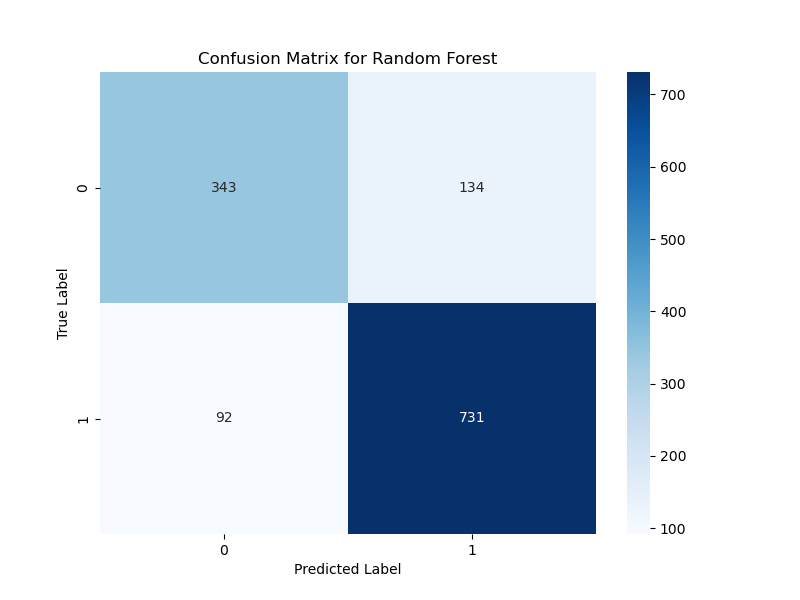
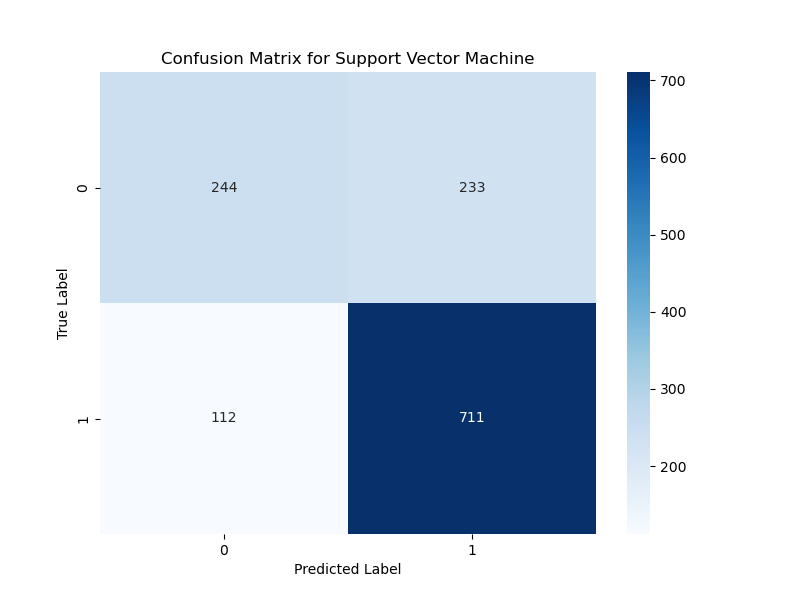
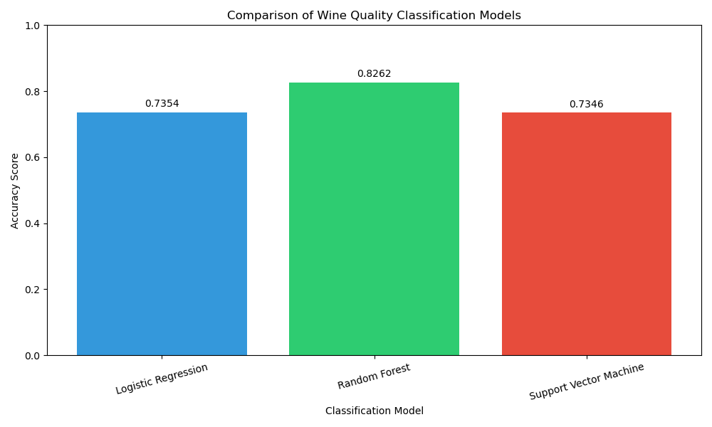

***FCIM.FIA - Fundamentals of Artificial Intelligence***

> **Lab 4:** *Machine Learning* \
> **Performed by:** *Dumitru Moraru*, group *FAF-212* \
> **Verified by:** Elena Graur, asist. univ.

Imports and Utils


```python
import pandas as pd
import numpy as np
import matplotlib.pyplot as plt
import seaborn as sns
from sklearn.model_selection import train_test_split
from sklearn.preprocessing import StandardScaler
from sklearn.ensemble import RandomForestClassifier
from sklearn.svm import SVC
from sklearn.linear_model import LogisticRegression
from sklearn.metrics import accuracy_score, classification_report, confusion_matrix
```

# Task 1
The dataset is loaded using Pandas, and basic information is displayed, including missing values and column types.


```python
# Load the wine quality dataset
file_path = 'wine-quality-white-and-red.csv'
wine_data = pd.read_csv(file_path)

# Display the first few rows of the dataset to understand its structure
print("Preview of the dataset:")
print(wine_data.head())

# Display information about the dataset (columns, data types, non-null values)
print("\nDataset Information:")
print(wine_data.info())

# Check for missing values in the dataset
missing_values = wine_data.isnull().sum()
print("\nMissing Values:")
print(missing_values)
```

Explanation
* The dataset is read from a CSV file.
* First 5 rows and column details are displayed.
* Checks for missing values to ensure data quality.

# Task 2
If the dataset contains categorical columns (e.g., `type` for red or white wine), they are converted into numerical format using one-hot encoding.


```python
# Convert categorical column 'type' to numerical using one-hot encoding (if present)
if 'type' in wine_data.columns:
    print("\nConverting wine type to numerical values")
    wine_data = pd.get_dummies(wine_data, columns=['type'], drop_first=True)
    # Note: drop_first=True avoids multicollinearity by removing one redundant column
```

Explanation
* Converts categorical values (e.g., red or white) into numerical values (0 or 1).
* Drops one of the categories to avoid multicollinearity.

# Task 3
The target variable is wine quality, which is converted into a binary classification:

* Good (1): Quality ≥6
* Bad (0): Quality <6


```python
# Separate features (X) and target variable (y)
X = wine_data.drop(columns=['quality'])  # All columns except 'quality' are features
y = wine_data['quality']                 # 'quality' is the target variable

# Convert quality rating into binary classification:
# Good quality (1): rating >= 6
# Bad quality (0): rating < 6
y = np.where(y >= 6, 1, 0)
print(f"\nClass distribution after binarization: {np.bincount(y)}")
print(f"Positive class (Good wine) percentage: {np.mean(y) * 100:.2f}%")
```

Explanation
* `X` contains all features except `quality`.
* `y` is transformed into a binary classification based on quality thresholds.

# Task 4
The dataset is split into training (80%) and testing (20%) sets. The features are standardized using StandardScaler to improve model performance.


```python
# Split the dataset into training (80%) and testing (20%) sets
# random_state ensures reproducibility, stratify maintains class distribution
X_train, X_test, y_train, y_test = train_test_split(
    X, y, test_size=0.2, random_state=42, stratify=y
)
print(f"\nTraining set size: {X_train.shape[0]} samples")
print(f"Testing set size: {X_test.shape[0]} samples")

# Standardize features: rescaling to mean=0 and variance=1
# This is important for models like SVM and Logistic Regression
scaler = StandardScaler()
X_train = scaler.fit_transform(X_train)  # Fit to training data and transform it
X_test = scaler.transform(X_test)        # Apply same transformation to test data
```

Explanation
* Stratified splitting ensures balanced class distribution.
* Feature scaling standardizes data to improve ML model performance.

# Task 5
Three machine learning models are trained and compared:

* Logistic Regression
* Random Forest Classifier
* Support Vector Machine (SVM)

Each model is evaluated using:

* Accuracy Score
* Classification Report (Precision, Recall, F1-Score)
* Confusion Matrix


```python
# Initialize the classification models to test
models = {
    'Logistic Regression': LogisticRegression(),
    'Random Forest': RandomForestClassifier(n_estimators=100, random_state=42),
    'Support Vector Machine': SVC(kernel='linear')
}

# Dictionary to store accuracy results for comparison
results = {}

# Train each model and evaluate performance
for name, model in models.items():
    print(f"\n{'-'*50}")
    print(f"Training and evaluating: {name}")
    
    # Train the model
    model.fit(X_train, y_train)
    
    # Make predictions on test data
    y_pred = model.predict(X_test)
    
    # Calculate accuracy and store in results dictionary
    accuracy = accuracy_score(y_test, y_pred)
    results[name] = accuracy
    
    # Print performance metrics
    print(f"\n{name} Model Performance:")
    print(f"Accuracy: {accuracy:.4f}")
    
    # Display detailed classification metrics
    print("\nClassification Report:")
    print(classification_report(y_test, y_pred))
    
    # Create and display confusion matrix
    print("Confusion Matrix:")
    cm = confusion_matrix(y_test, y_pred)
    plt.figure(figsize=(8, 6))
    sns.heatmap(cm, annot=True, fmt='d', cmap='Blues')
    plt.title(f'Confusion Matrix for {name}')
    plt.xlabel('Predicted Label')
    plt.ylabel('True Label')
    plt.show()
```

Explanation
* Each model is trained on `X_train`, `y_train` and predicts on `X_test`.
* The accuracy is calculated and stored for comparison.
* A classification report is displayed to evaluate performance metrics.
* Confusion matrix visualizes correct vs incorrect predictions.

# Task 6
The accuracy scores of the three models are compared using a bar chart.


```python
# Create a bar chart to compare the performance of all models
plt.figure(figsize=(10, 6))
bars = plt.bar(
    results.keys(), 
    results.values(), 
    color=['#3498db', '#2ecc71', '#e74c3c']
)

# Add data labels on top of each bar
for bar in bars:
    height = bar.get_height()
    plt.text(
        bar.get_x() + bar.get_width()/2.,
        height + 0.01,
        f'{height:.4f}',
        ha='center', 
        va='bottom'
    )

plt.xlabel("Classification Model")
plt.ylabel("Accuracy Score")
plt.title("Comparison of Wine Quality Classification Models")
plt.ylim(0, 1)  # Set y-axis limits from 0 to 1 (accuracy range)
plt.xticks(rotation=15)  # Rotate labels for better readability
plt.tight_layout()
plt.show()

print("\nAnalysis complete!")
```

Explanation
* Bar chart compares the accuracy of different models.
* Different colors represent each model's accuracy.
* Y-axis is limited between 0 and 1 for clarity.






# Conclusions:
This lab successfully demonstrates wine quality classification using machine learning. The results indicate that:

* Feature engineering and standardization improve model performance.
* Random Forest Classifier is the most effective model for this dataset.
* Confusion matrices and classification reports provide deeper insights into model performance.

# Bibliography:

1) https://www.geeksforgeeks.org/ml-linear-regression/
2) https://trendspider.com/learning-center/linear-regression-intercept-predicting-future-values-and-trends/
3) https://scikit-learn.org/1.5/modules/linear_model.html
4) https://medium.com/@hannah.hj.do/getting-to-know-lars-least-angle-regression-f50e94c34b97
5) https://scikit-learn.org/1.5/api/sklearn.metrics.html#module-sklearn.metrics
6) https://www.geeksforgeeks.org/clustering-in-machine-learning/
7) https://www.geeksforgeeks.org/k-means-clustering-introduction/
8) https://scikit-learn.org/1.5/api/sklearn.cluster.html
